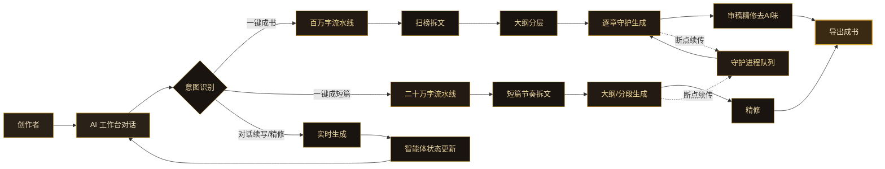

# InkForge（墨铸）— AI 写作工作台 PRD

## 1. 产品概述

InkForge 是一个面向长短篇小说、剧本剧作与 IP 内容的 AI 创作工作台。融合 oh-story-claudecode 的"扫榜→拆文→创作→精修"写作方法论与 InkOS 的"创意/设定/角色/记忆/审稿/修订"智能体状态分层，通过 AI 聊天对话即可驱动任意项目一键生成文章，长篇最高百万字、短篇最高二十万字，后台守护进程持续生产。

- **解决的核心问题**：将分散的网文写作方法论整合为可执行的 AI Agent 流水线，让单一对话即可驱动从灵感到成书的全流程，支持断点续传与离线后台生产。
- **目标用户**：网文作者、短篇写手、剧本创作者、内容工作室；既可单机本地部署自用，也可服务器部署多人协作。
- **市场价值**：把"套路 = 确定性的情绪满足"方法论产品化，降低长篇连载门槛，提升短篇产出效率。

## 2. 核心功能

### 2.1 用户角色

| 角色 | 接入方式 | 核心权限 |
|------|----------|----------|
| 本地创作者 | 单机启动免登录 | 全部写作、生成、导出、守护进程权限 |
| 工作台用户 | 服务器部署邮箱注册 | 个人项目 CRUD、协作、生成配额 |
| 管理员 | 后台指派 | 用户管理、模型配置、守护进程监控、全局配额 |

### 2.2 功能模块

1. **工作台（Studio）**：AI 聊天对话主界面，流式输出，可调用任意项目执行生成任务
2. **项目管理**：长篇/短篇/剧本项目 CRUD，章节树，版本快照
3. **一键生成**：成书（百万字流水线）/ 成短篇（二十万字流水线）一键触发
4. **写作方法论引擎**：扫榜、拆文、创作、精修四阶段 skill 编排
5. **智能体状态层**：创意、设定、角色、记忆、审稿、修订、封面共享状态
6. **守护进程**：后台任务队列、断点续传、自动续写、失败重试
7. **模型中心**：多提供商适配（OpenAI/Anthropic/DeepSeek/通义千问），API Key 管理，模型路由
8. **导出中心**：TXT/Markdown/EPUB/DOCX 导出，封面生成
9. **设置**：本地部署与服务器部署切换，主题，响应式多端适配

### 2.3 页面详情

| 页面名称 | 模块名称 | 功能描述 |
|----------|----------|----------|
| 工作台 | AI 对话区 | 流式聊天、@项目调用、工具栏一键生成、消息历史、断点续传状态条 |
| 工作台 | 上下文面板 | 当前项目智能体状态（创意/设定/角色/记忆/审稿/修订）可视化 |
| 工作台 | 任务进度面板 | 守护进程任务列表、进度条、章节生成进度、队列管理 |
| 项目列表 | 项目卡片网格 | 长篇/短篇/剧本分类、字数统计、最近编辑、新建项目 |
| 项目详情 | 章节树编辑器 | 章节大纲树、双栏编辑（左大纲右正文）、版本快照、字数追踪 |
| 一键生成向导 | 流水线配置 | 选择成书/成短篇、目标字数、题材、人设、钩子风格、节奏配置 |
| 模型中心 | 提供商卡片 | API Key 配置、模型列表、默认模型、温度/上下文配置、连通性测试 |
| 守护进程监控 | 任务仪表盘 | 运行中/排队/失败任务、CPU/内存、日志流、自动续写开关 |
| 导出中心 | 导出配置 | 格式选择、章节范围、封面选项、导出历史 |
| 设置 | 部署与外观 | 本地/服务器模式、端口、数据目录、主题色、字体、多端预览 |

## 3. 核心流程

### 3.1 一键成书流程（百万字）
用户在工作台选定项目或输入种子设定 → 选择"一键成书" → 配置目标字数（≤100万）、题材、人设、钩子风格 → 系统编排四阶段流水线：扫榜拆文 → 大纲分层（卷/章/节）→ 逐章生成（守护进程并发）→ 审稿精修去 AI 味 → 章节聚合导出。全程后台守护，断点续传，用户可关闭浏览器。

### 3.2 一键成短篇流程（二十万字）
输入主题/方向 → 选择"一键成短篇" → 配置目标字数（≤20万）、风格、结局走向 → 流水线：拆文短篇节奏 → 大纲 → 一次性或分段生成 → 精修 → 导出。

### 3.3 AI 对话驱动生成
用户在聊天框输入指令或 @项目 → 后端识别意图（生成/续写/精修/拆文）→ 调用对应 skill → 流式返回 → 自动写入对应章节并更新智能体状态。

## 4. 用户界面设计

### 4.1 设计风格

**美学方向：文人书房暗色工作室（Literary Dark Studio）**
受 taste-skill "Anti-Slop" 原则启发，拒绝通用 SaaS 模板感，营造沉浸式写作氛围。

- **主色调**：墨黑底 `#0E0B08`（带暖色温的深炭黑）+ 旧纸暖白前景 `#F5E6C8`；次级面板 `#1A1410`/`#241A14`
- **强调色**：灯下琥珀金 `#D4A534`（主）/ `#8B6914`（深）/ `#C8961E`（中），呼应"墨与灯"
- **次强调**：朱砂红 `#B23A48`（用于警示/进度高点），青瓷绿 `#5A8A6A`（用于成功状态）
- **字体**：标题用衬线 Fraunces（文学感、可变字重），正文 UI 用 Manrope（清晰几何感），代码/数据用 JetBrains Mono；中文用思源宋体 + 思源黑体
- **按钮风格**：低圆角（4-6px），主按钮琥珀金实底带细微内发光，次按钮描边透明背景，hover 时琥珀金边亮起
- **布局风格**：桌面三栏（左侧导航/章节树 + 中间对话或正文 + 右侧上下文状态面板），移动端抽屉式收起
- **图标**：线性细描图标（Lucide 风格），1.5px 描边，与衬线标题形成对比
- **动效**：react-bits 的 BlurText 用于标题入场、流式输出打字光标、章节生成时的进度条流光、背景细微噪点纹理 + 暗角光晕

### 4.2 页面设计概览

| 页面名称 | 模块名称 | UI 元素 |
|----------|----------|----------|
| 工作台 | 顶栏 | 墨黑底，左侧项目切换器+章节面包屑，中间模型选择器，右侧守护进程状态徽标+用户头像 |
| 工作台 | 对话区 | 暗色卡片气泡（用户琥珀金描边/AI 旧纸色），流式打字光标，底部输入框带工具栏（@项目、一键生成、续写、精修） |
| 工作台 | 上下文面板 | 折叠式智能体状态卡（创意/设定/角色/记忆/审稿/修订），每张卡显示摘要与字数进度环 |
| 工作台 | 任务进度面板 | 守护任务行，进度条流光动画，状态徽标，可暂停/恢复/取消 |
| 项目列表 | 项目卡片 | 网格卡片，封面渐变缩略图，标题衬线字体，字数进度，最近编辑时间，hover 时琥珀金边亮起 |
| 项目详情 | 章节树 | 左侧可折叠树（卷>章>节），右侧双栏编辑器（大纲|正文），顶部字数追踪条与版本快照按钮 |
| 一键生成向导 | 步骤卡 | 居中卡片式向导，每步大号衬线标题+BlurText 入场，配置项卡片化，底部预估字数与开始按钮 |
| 模型中心 | 提供商卡片 | 提供商 logo 卡片网格，连通性状态点（青瓷绿在线/朱砂红异常），展开配置表单 |
| 守护进程监控 | 仪表盘 | 顶部资源占用环形图，任务列表带日志流（等宽字体，琥珀金高亮关键词） |
| 导出中心 | 导出卡 | 格式选择图标卡，章节范围滑块，封面预览，导出历史时间线 |
| 设置 | 设置分组 | 左侧分组导航，右侧表单，部署模式切换（本地/服务器）带说明，主题与字体实时预览 |

### 4.3 响应式适配

- **桌面优先**（≥1280px）：三栏完整布局，对话区与正文区可切换或并排
- **平板**（768-1279px）：右侧状态面板转为可滑出抽屉，导航折叠为图标栏
- **手机**（<768px）：单栏布局，底部 Tab 导航（工作台/项目/任务/我的），对话全屏，章节树与状态面板为全屏模态
- **触控优化**：增大点击区（≥44px），输入框聚焦时放大，长按章节显示操作菜单
- **暗色为主**，提供"旧纸"浅色主题切换（暖米色底 `#F5E6C8` + 墨色文字）

## 5. 写作方法论集成（基于 oh-story-claudecode）

将 oh-story 的 skill 包产品化为可编排的流水线节点：
- **扫榜节点**：分析热门榜单，输出题材/人设/切入点洞察
- **拆文节点**：拆解大纲节奏与剧情素材，建立个人模块库
- **创作节点**：运用钩子、爽感、期待感技巧生成正文
- **精修节点**：去 AI 味，统一文风，强化情绪满足

四条主线：爆款逆向 · 剧情模块化重组 · 上下文状态分层管理 · 人机协同。

## 6. 输出模型设置（基于 InkOS）

智能体状态分层模型，跨任务共享：
- **创意**：核心点子、题材定位
- **设定**：世界观、规则、背景
- **角色**：人物卡、关系网、成长弧
- **记忆**：已发生事件、伏笔、回收点
- **审稿**：质量评估、节奏诊断
- **修订**：修改建议、版本差异
- **封面**：视觉风格、生成参数

## 7. 部署与守护进程

- **本地部署**：单条命令启动，数据存于本地 `./data` 目录，守护进程随主进程运行
- **服务器部署**：Docker Compose 一体化，含应用、守护进程、数据卷、反向代理可选
- **守护进程**：独立 worker 进程消费任务队列，主进程崩溃后可独立续跑；支持定时自动续写
- **断点续传**：每章生成结果即时落盘，任务状态持久化，重启后从中断点恢复
