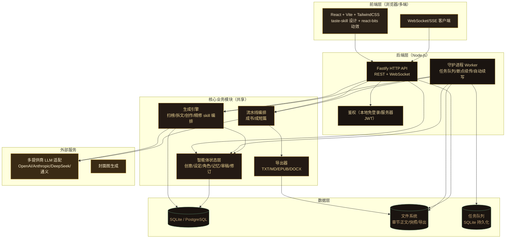
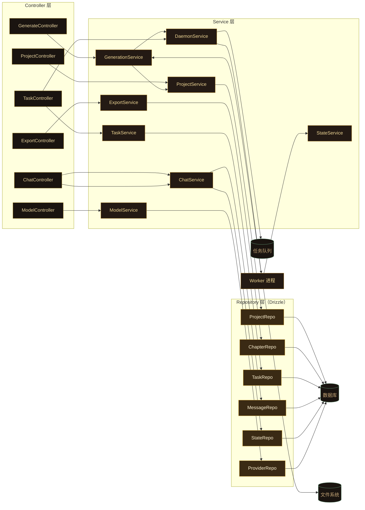

# InkForge（墨铸）— 技术架构文档

## 1. 架构设计

采用 monorepo（pnpm workspaces）前后端分离架构。前端 React+Vite+TS，后端 Node.js+Fastify+TS。后端内含 HTTP API 服务与守护进程 worker，共享核心业务模块。多提供商 LLM 通过统一适配层接入。数据持久化使用 SQLite（本地）与 PostgreSQL（服务器可选）。



## 2. 技术栈说明

- **Monorepo**：pnpm workspaces + Turborepo 编排
- **前端**：React 18 + Vite 5 + TypeScript 5 + TailwindCSS 3 + React Router 6 + TanStack Query + Zustand 状态管理 + Motion 动效库 + react-bits 组件（手写移植，非依赖）
- **后端**：Node.js 20 + Fastify 4 + TypeScript 5 + WebSocket（ws）
- **守护进程**：独立 worker 入口，复用核心模块；基于 BullMQ 风格的简化持久化队列（SQLite）
- **数据库**：默认 SQLite（better-sqlite3，本地零配置）；服务器部署可切换 PostgreSQL（pg）
- **ORM**：Drizzle ORM（同时支持 SQLite 与 PostgreSQL）
- **LLM 适配**：自研统一适配层，兼容 OpenAI/Anthropic/DeepSeek/通义千问 OpenAI 兼容协议与原生 SDK
- **导出**：epub-gen、markdown-it、docx
- **部署**：Docker Compose 一体化（应用 + worker 共享镜像，分服务）；本地 pnpm dev 直接运行
- **初始化工具**：vite-init（前端）、pnpm init（后端）

## 3. 路由定义（前端）

| 路由 | 用途 |
|------|------|
| `/` | 重定向到 `/studio` |
| `/studio` | 工作台 AI 对话主界面 |
| `/projects` | 项目列表 |
| `/projects/:id` | 项目详情（章节树 + 编辑器） |
| `/projects/:id/chapter/:chapterId` | 章节正文编辑 |
| `/generate` | 一键生成向导（成书/成短篇） |
| `/models` | 模型中心 |
| `/daemon` | 守护进程监控 |
| `/export` | 导出中心 |
| `/settings` | 设置（部署/外观/数据） |
| `/login` | 服务器模式登录（本地模式隐藏） |

## 4. API 定义

### 4.1 基础约定
- REST 前缀 `/api/v1`
- WebSocket 端点 `/ws`（流式生成、任务进度推送）
- 服务器模式需 JWT，本地模式跳过鉴权
- 统一响应：`{ ok: boolean, data?: T, error?: { code: string, message: string } }`

### 4.2 核心 API

```typescript
// 项目
interface Project { id: string; title: string; type: 'long'|'short'|'script'; targetWords: number; currentWords: number; createdAt: number; updatedAt: number; }
GET    /api/v1/projects                 // 列表
POST   /api/v1/projects                 // 创建
GET    /api/v1/projects/:id             // 详情
PATCH  /api/v1/projects/:id             // 更新
DELETE /api/v1/projects/:id             // 删除
GET    /api/v1/projects/:id/chapters    // 章节树
POST   /api/v1/projects/:id/chapters    // 新建章节

// 章节
interface Chapter { id: string; projectId: string; parentId: string|null; title: string; outline: string; content: string; order: number; wordCount: number; status: 'draft'|'generating'|'done'; }
PATCH  /api/v1/chapters/:id             // 更新正文/大纲
POST   /api/v1/chapters/:id/snapshot   // 版本快照

// 对话
interface ChatMessage { id: string; role: 'user'|'assistant'|'system'; content: string; projectId?: string; createdAt: number; }
GET    /api/v1/projects/:id/messages     // 历史
POST   /api/v1/chat                     // 发送（返回 messageId，流式通过 WS）
// WS 消息：{ type:'chat:chunk'|'chat:done'|'task:progress', ... }

// 智能体状态
interface AgentState { projectId: string; idea: object; setting: object; characters: object; memory: object; review: object; revision: object; cover: object; }
GET    /api/v1/projects/:id/state       // 获取
PATCH  /api/v1/projects/:id/state       // 更新（部分字段）

// 一键生成
interface GenerateRequest { projectId?: string; kind: 'book'|'short'; targetWords: number; config: { genre: string; characters: object; hookStyle: string; pace: string; }; }
POST   /api/v1/generate                 // 触发流水线（返回 taskId）

// 守护进程任务
interface Task { id: string; type: 'book'|'short'|'chapter'|'refine'; projectId: string; status: 'queued'|'running'|'paused'|'done'|'failed'; progress: number; createdAt: number; }
GET    /api/v1/tasks                    // 列表（可按 project 过滤）
GET    /api/v1/tasks/:id                // 详情
POST   /api/v1/tasks/:id/pause          // 暂停
POST   /api/v1/tasks/:id/resume         // 恢复
POST   /api/v1/tasks/:id/cancel         // 取消
GET    /api/v1/daemon/status            // 守护进程状态

// 模型
interface Provider { id: string; name: string; kind: 'openai'|'anthropic'|'deepseek'|'qwen'|'custom'; baseUrl: string; apiKey: string; models: string[]; }
GET    /api/v1/providers                // 列表
POST   /api/v1/providers                // 添加
PATCH  /api/v1/providers/:id             // 更新
DELETE /api/v1/providers/:id             // 删除
POST   /api/v1/providers/:id/test       // 连通性测试
GET    /api/v1/models                   // 可用模型聚合
POST   /api/v1/chat/completions         // 透传（流式 SSE，调试/直接调用）

// 导出
POST   /api/v1/export                   // { projectId, format, chapterRange } -> 返回下载 url
GET    /api/v1/exports                   // 导出历史
```

## 5. 服务端架构图



## 6. 数据模型

### 6.1 ER 图

```mermaid
erDiagram
    PROJECT ||--o{ CHAPTER : has
    PROJECT ||--|| AGENT_STATE : owns
    PROJECT ||--o{ MESSAGE : has
    PROJECT ||--o{ TASK : spawns
    PROJECT ||--o{ EXPORT : produces
    CHAPTER ||--o{ CHAPTER_SNAPSHOT : versions
    CHAPTER ||--o{ CHAPTER : "parent of"
    TASK ||--o{ TASK_LOG : logs
    PROVIDER ||--o{ MODEL_CONFIG : configures

    PROJECT {
        text id PK
        text title
        text type
        integer target_words
        integer current_words
        integer created_at
        integer updated_at
    }
    CHAPTER {
        text id PK
        text project_id FK
        text parent_id FK
        text title
        text outline
        text content
        integer order_idx
        integer word_count
        text status
    }
    AGENT_STATE {
        text project_id PK FK
        text idea_json
        text setting_json
        text characters_json
        text memory_json
        text review_json
        text revision_json
        text cover_json
        integer updated_at
    }
    TASK {
        text id PK
        text project_id FK
        text type
        text status
        real progress
        text config_json
        text checkpoint_json
        integer created_at
        integer updated_at
    }
    MESSAGE {
        text id PK
        text project_id FK
        text role
        text content
        integer created_at
    }
    CHAPTER_SNAPSHOT {
        text id PK
        text chapter_id FK
        text content
        integer created_at
    }
    PROVIDER {
        text id PK
        text name
        text kind
        text base_url
        text api_key_enc
        text created_at
    }
    MODEL_CONFIG {
        text id PK
        text provider_id FK
        text model
        real temperature
        integer max_tokens
        integer is_default
    }
    TASK_LOG {
        text id PK
        text task_id FK
        text level
        text message
        integer created_at
    }
    EXPORT {
        text id PK
        text project_id FK
        text format
        text chapter_range
        text file_path
        integer created_at
    }
```

### 6.2 DDL（SQLite 示例，Drizzle schema 等价）

```sql
CREATE TABLE project (
  id TEXT PRIMARY KEY,
  title TEXT NOT NULL,
  type TEXT NOT NULL CHECK(type IN ('long','short','script')),
  target_words INTEGER NOT NULL DEFAULT 0,
  current_words INTEGER NOT NULL DEFAULT 0,
  created_at INTEGER NOT NULL,
  updated_at INTEGER NOT NULL
);

CREATE TABLE chapter (
  id TEXT PRIMARY KEY,
  project_id TEXT NOT NULL REFERENCES project(id) ON DELETE CASCADE,
  parent_id TEXT REFERENCES chapter(id) ON DELETE CASCADE,
  title TEXT NOT NULL,
  outline TEXT DEFAULT '',
  content TEXT DEFAULT '',
  order_idx INTEGER NOT NULL DEFAULT 0,
  word_count INTEGER NOT NULL DEFAULT 0,
  status TEXT NOT NULL DEFAULT 'draft' CHECK(status IN ('draft','generating','done')),
  created_at INTEGER NOT NULL,
  updated_at INTEGER NOT NULL
);
CREATE INDEX idx_chapter_project ON chapter(project_id);
CREATE INDEX idx_chapter_parent ON chapter(parent_id);

CREATE TABLE agent_state (
  project_id TEXT PRIMARY KEY REFERENCES project(id) ON DELETE CASCADE,
  idea_json TEXT DEFAULT '{}',
  setting_json TEXT DEFAULT '{}',
  characters_json TEXT DEFAULT '{}',
  memory_json TEXT DEFAULT '{}',
  review_json TEXT DEFAULT '{}',
  revision_json TEXT DEFAULT '{}',
  cover_json TEXT DEFAULT '{}',
  updated_at INTEGER NOT NULL
);

CREATE TABLE task (
  id TEXT PRIMARY KEY,
  project_id TEXT NOT NULL REFERENCES project(id) ON DELETE CASCADE,
  type TEXT NOT NULL,
  status TEXT NOT NULL DEFAULT 'queued' CHECK(status IN ('queued','running','paused','done','failed')),
  progress REAL NOT NULL DEFAULT 0,
  config_json TEXT DEFAULT '{}',
  checkpoint_json TEXT DEFAULT '{}',
  created_at INTEGER NOT NULL,
  updated_at INTEGER NOT NULL
);
CREATE INDEX idx_task_project ON task(project_id);
CREATE INDEX idx_task_status ON task(status);

CREATE TABLE message (
  id TEXT PRIMARY KEY,
  project_id TEXT NOT NULL REFERENCES project(id) ON DELETE CASCADE,
  role TEXT NOT NULL,
  content TEXT NOT NULL,
  created_at INTEGER NOT NULL
);
CREATE INDEX idx_message_project ON message(project_id);

CREATE TABLE chapter_snapshot (
  id TEXT PRIMARY KEY,
  chapter_id TEXT NOT NULL REFERENCES chapter(id) ON DELETE CASCADE,
  content TEXT NOT NULL,
  created_at INTEGER NOT NULL
);

CREATE TABLE provider (
  id TEXT PRIMARY KEY,
  name TEXT NOT NULL,
  kind TEXT NOT NULL,
  base_url TEXT NOT NULL,
  api_key_enc TEXT DEFAULT '',
  created_at INTEGER NOT NULL
);

CREATE TABLE model_config (
  id TEXT PRIMARY KEY,
  provider_id TEXT NOT NULL REFERENCES provider(id) ON DELETE CASCADE,
  model TEXT NOT NULL,
  temperature REAL DEFAULT 0.8,
  max_tokens INTEGER DEFAULT 4096,
  is_default INTEGER NOT NULL DEFAULT 0
);

CREATE TABLE task_log (
  id TEXT PRIMARY KEY,
  task_id TEXT NOT NULL REFERENCES task(id) ON DELETE CASCADE,
  level TEXT NOT NULL,
  message TEXT NOT NULL,
  created_at INTEGER NOT NULL
);

CREATE TABLE export_record (
  id TEXT PRIMARY KEY,
  project_id TEXT NOT NULL REFERENCES project(id) ON DELETE CASCADE,
  format TEXT NOT NULL,
  chapter_range TEXT DEFAULT '',
  file_path TEXT NOT NULL,
  created_at INTEGER NOT NULL
);
```

## 7. 目录结构

```
inkforge/
├── package.json                 # pnpm workspace 根
├── pnpm-workspace.yaml
├── turbo.json
├── docker-compose.yml
├── Dockerfile
├── .env.example
├── apps/
│   ├── web/                     # 前端 React+Vite
│   │   ├── src/
│   │   │   ├── main.tsx
│   │   │   ├── App.tsx
│   │   │   ├── pages/           # 路由页面
│   │   │   ├── components/      # 组件（含 react-bits 移植）
│   │   │   ├── stores/          # Zustand
│   │   │   ├── api/             # API 客户端
│   │   │   ├── hooks/
│   │   │   └── styles/
│   │   └── index.html
│   └── server/                  # 后端 Fastify
│       ├── src/
│       │   ├── index.ts         # HTTP 服务入口
│       │   ├── worker.ts        # 守护进程入口
│       │   ├── controllers/
│       │   ├── services/
│       │   ├── repositories/
│       │   ├── db/              # Drizzle schema + migration
│       │   ├── llm/             # 多提供商适配层
│       │   ├── engine/          # 扫榜/拆文/创作/精修 skill 编排
│       │   ├── pipeline/        # 成书/成短篇流水线
│       │   ├── state/           # 智能体状态层
│       │   ├── daemon/          # 任务队列/worker
│       │   ├── export/          # 导出器
│       │   ├── routes/
│       │   └── utils/
│       └── data/                # 运行时数据（章节正文/快照/导出）
└── packages/
    └── shared/                  # 前后端共享类型
        └── src/types.ts
```
